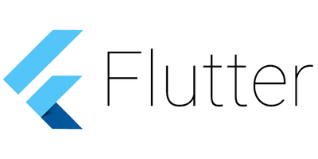

<p align="center">
    
</p>


<style>.bmc-button img{height: 34px !important;width: 35px !important;margin-bottom: 1px !important;box-shadow: none !important;border: none !important;vertical-align: middle !important;}.bmc-button{padding: 7px 10px 7px 10px !important;line-height: 35px !important;height:51px !important;min-width:217px !important;text-decoration: none !important;display:inline-flex !important;color:#ffffff !important;background-color:#5F7FFF !important;border-radius: 5px !important;border: 1px solid transparent !important;padding: 7px 10px 7px 10px !important;font-size: 22px !important;letter-spacing: 0.6px !important;box-shadow: 0px 1px 2px rgba(190, 190, 190, 0.5) !important;-webkit-box-shadow: 0px 1px 2px 2px rgba(190, 190, 190, 0.5) !important;margin: 0 auto !important;font-family:'Cookie', cursive !important;-webkit-box-sizing: border-box !important;box-sizing: border-box !important;-o-transition: 0.3s all linear !important;-webkit-transition: 0.3s all linear !important;-moz-transition: 0.3s all linear !important;-ms-transition: 0.3s all linear !important;transition: 0.3s all linear !important;}.bmc-button:hover, .bmc-button:active, .bmc-button:focus {-webkit-box-shadow: 0px 1px 2px 2px rgba(190, 190, 190, 0.5) !important;text-decoration: none !important;box-shadow: 0px 1px 2px 2px rgba(190, 190, 190, 0.5) !important;opacity: 0.85 !important;color:#ffffff !important;}</style><link href="https://fonts.googleapis.com/css?family=Cookie" rel="stylesheet"><a class="bmc-button" target="_blank" href="https://www.buymeacoffee.com/SaNhE76x9"><span style="margin-left:15px;font-size:28px !important;">Buy me a coffee</span></a>


# Flutter Extended Zeplin Extension 💻

This is a new Flutter Extended version of the actual extension to help a lot of people who need more components than TextStyles and Colors and RichTexts. With this new one you have the opportunity to have more info about Widgets, for example, generate Container elements, BoxDecoration Widget with Shadows, Linear Gradients, Fills, Borders, Opacity and several components more. Coming soon RadialGradient and SweapGradient and also Components as buttons and others. 

## Getting started

Add the extension to your project from [extensions.zeplin.io](https://extensions.zeplin.io), then test the extension and give me your comments about possible improvements. I will try giving frequently support to this extension.

## Output

#### Sample colors output
```
const Color black = const Color(0xff000000);
const Color white = const Color(0xffffffff);
const Color cloudyBlue = const Color(0xffbec4cd);
const Color black = const Color(0xff333333);
const Color blushPink = const Color(0xffff8993);

```

#### Sample text style output:
```
const TextStyle title = const TextStyle(
    fontFamily: 'Montserrat',
    color: Color(0xff000000),
    fontSize: 14,
    fontWeight: FontWeight.w500,
    fontStyle: FontStyle.normal, 
    );
const TextStyle PingFangSC—14pt = const TextStyle(
    fontFamily: 'PingFangSC',
    color: Color(0xff000000),
    fontSize: 14,
    fontWeight: FontWeight.w400,
    fontStyle: FontStyle.normal,
    );

```
#### Sample layer output - `(Text with Shadows)` 

```
new Text("Color",
    style: TextStyle(
    fontFamily: 'Montserrat',
    color: Color(0xfffefefe),
    fontSize: 10,
    fontWeight: FontWeight.w500,
    fontStyle: FontStyle.normal,
    
    shadows: [BoxShadow(
        color: Color(0x29646464),
        offset: Offset(0,3),
        blurRadius: 6,
        spreadRadius: 0

      )],
    )
)
```

#### Sample layer output - `(Text with multiple Styles)` 

```
RichText(
    text: new TextSpan(
    children: [
      new TextSpan(
        text: "EN | ",
        style: TextStyle(
        fontFamily: 'Segoe UI',
        color: Color(0xfff4b326),
        fontSize: 12,
        fontWeight: FontWeight.w400,
        fontStyle: FontStyle.normal,
        )
      ),
      new TextSpan(
        text: "CH",
        style: TextStyle(
        fontFamily: 'Segoe UI',
        color: Color(0xff444242),
        fontSize: 12,
        fontWeight: FontWeight.w400,
        fontStyle: FontStyle.normal,
        )
      ),
    ]
  )
)
```

#### Sample layer output - `(Container with Borders and Shadows)` 

```
new Container(
  width: 128,
  height: 172,
  decoration: new BoxDecoration(
    color: Color(0xff1b1b1b),
    border: Border.all(
      color: Color(0xfff19528),
      width: 1
    ),
	boxShadow: [BoxShadow(
        color: Color(0x29000000),
        offset: Offset(0,3),
        blurRadius: 6,
        spreadRadius: 0

    ) ],

  )
)
```

#### Sample layer output - `Container with Circular Borders` 
```
new Container(
  width: 103,
  height: 36,
  decoration: new BoxDecoration(
    color: Color(0xffd7d6d6),
	borderRadius: BorderRadius.circular(25),
	boxShadow: [
      BoxShadow(
        color: Color(0x29000000),
        offset: Offset(0,3),
        blurRadius: 6,
        spreadRadius: 0

    ) ],

  )
)
```

#### Sample layer output - `Container with Fill with Opacity` 
```
new Container(
  width: 169,
  height: 269,
  decoration: new BoxDecoration(
    color: Color(0xfffbd085).withOpacity(0.46)
  )
)
```

#### Sample layer output - `Container with LinearGradient` 

```
new Container(
  width: 30.492919921875,
  height: 30.4931640625,
  decoration: new BoxDecoration(
    gradient: LinearGradient(
      colors: [
        Color(0xfff8362d),
        Color(0xff801c18),
        Color(0xff7c1b17) ],
    stops: [
        0,
        0.7395932078361511,
        1
    ]
    )
  )
)
```

## Options

There are several features to modify in the future, first of them will be add more options to Gradients, Radial and Sweap Gradients. If this is extension is useful for you and you want to support me [buy me a coffe!](https://www.buymeacoffee.com/SaNhE76x9)


## Developmentß

This extension is developed using [zem](https://github.com/zeplin/zem), Zeplin Extension Manager. zem is a command line tool that lets you quickly create, test and publish extensions.

To learn more about creating Zeplin extensions, [see documentation](https://github.com/zeplin/zeplin-extension-documentation).
ß